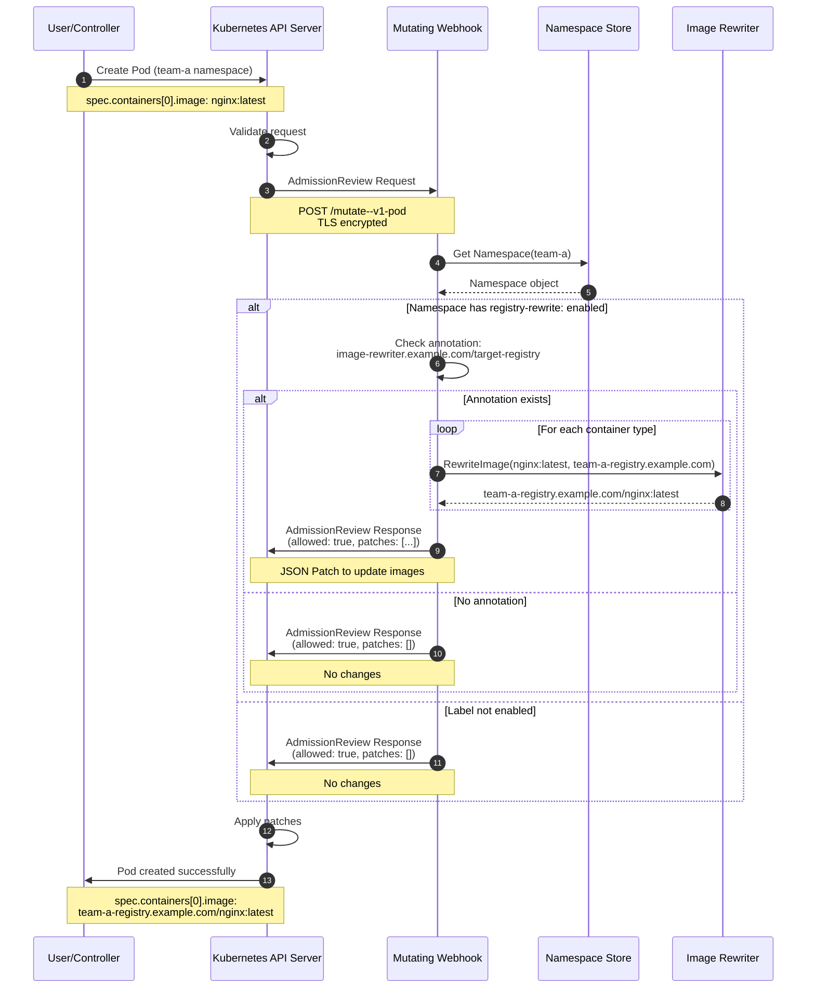

# Mutating Admission Controller Flow

## Overview

This diagram shows the complete flow of a pod creation request through the Kubernetes API server and the mutating registry hook webhook.

```mermaid
sequenceDiagram
    autonumber
    participant User as User/Controller
    participant API as Kubernetes API Server
    participant Webhook as Mutating Webhook
    participant NS as Namespace Store
    participant Rewriter as Image Rewriter

    User->>API: Create Pod (team-a namespace)
    Note over User,API: spec.containers[0].image: nginx:latest

    API->>API: Validate request
    API->>Webhook: AdmissionReview Request
    Note over API,Webhook: POST /mutate--v1-pod<br/>TLS encrypted

    Webhook->>NS: Get Namespace(team-a)
    NS-->>Webhook: Namespace object

    alt Namespace has registry-rewrite: enabled
        Webhook->>Webhook: Check annotation:<br/>image-rewriter.example.com/target-registry

        alt Annotation exists
            loop For each container type
                Webhook->>Rewriter: RewriteImage(nginx:latest, team-a-registry.example.com)
                Rewriter-->>Webhook: team-a-registry.example.com/nginx:latest
            end

            Webhook->>API: AdmissionReview Response<br/>(allowed: true, patches: [...])
            Note over Webhook,API: JSON Patch to update images
        else No annotation
            Webhook->>API: AdmissionReview Response<br/>(allowed: true, patches: [])
            Note over Webhook,API: No changes
        end
    else Label not enabled
        Webhook->>API: AdmissionReview Response<br/>(allowed: true, patches: [])
        Note over Webhook,API: No changes
    end

    API->>API: Apply patches
    API->>User: Pod created successfully
    Note over User,API: spec.containers[0].image:<br/>team-a-registry.example.com/nginx:latest
```

