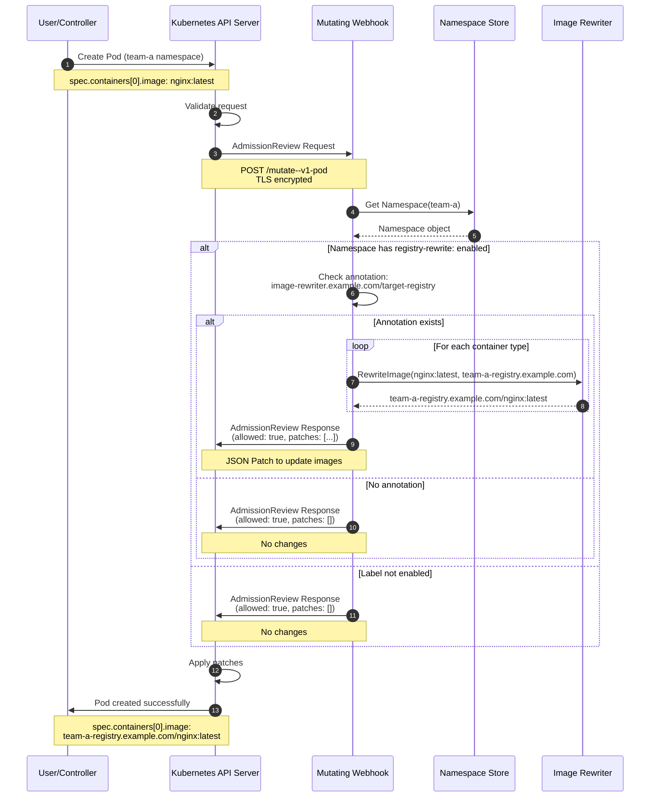
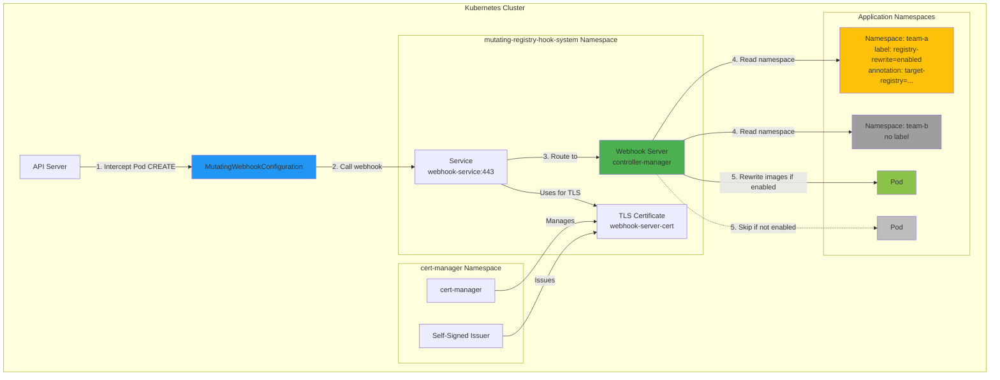
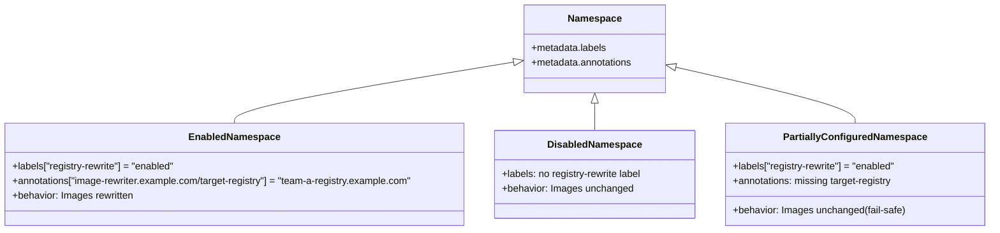
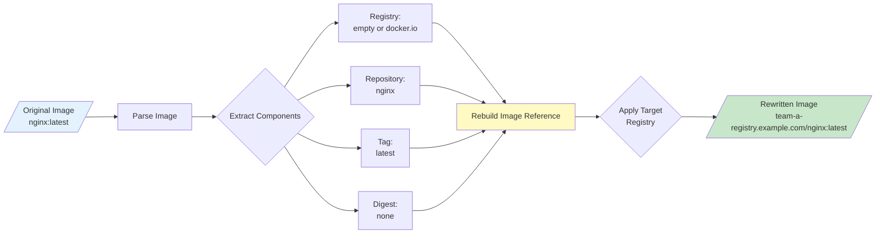
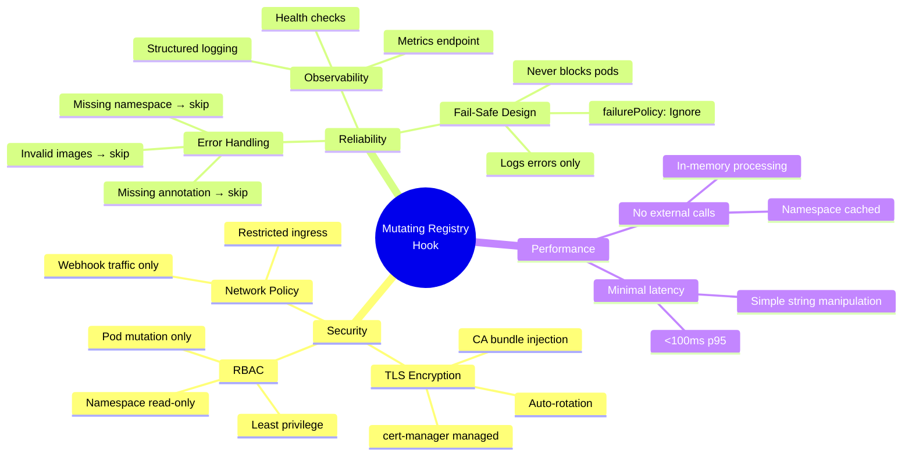
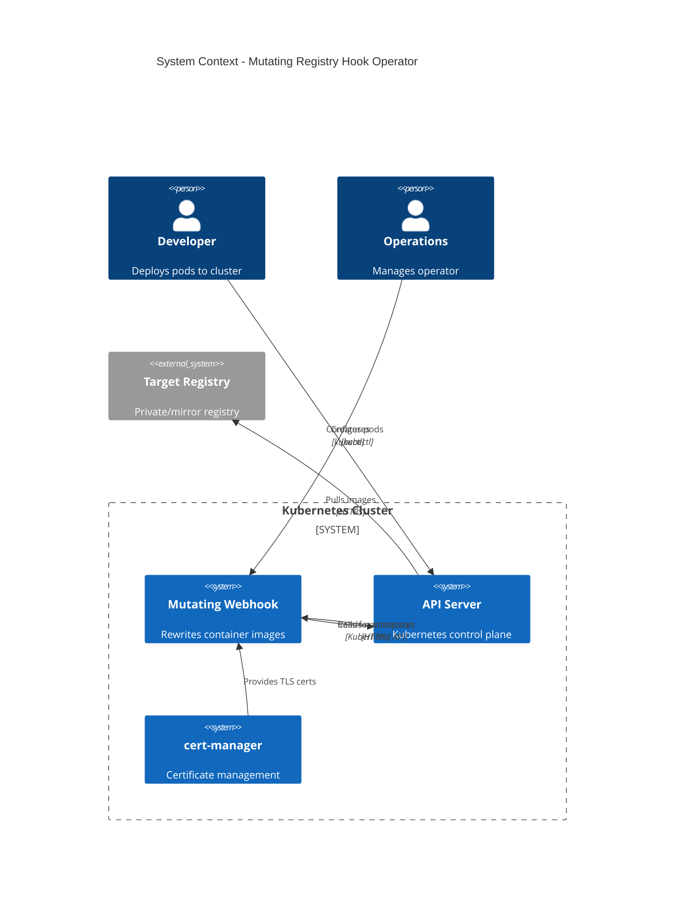

# Architecture Diagram

## Mutating Admission Controller Flow



## System Components



## Request/Response Flow

```mermaid
flowchart TD
    START([Pod Creation Request]) --> API[API Server]
    API --> CHECK{Mutating Webhooks<br/>configured?}

    CHECK -->|Yes| CALL[Call Webhook:<br/>POST /mutate--v1-pod]
    CHECK -->|No| ADMIT[Admit Pod]

    CALL --> AUTH{TLS Certificate<br/>Valid?}
    AUTH -->|No| FAIL[Webhook Fails]
    AUTH -->|Yes| WEBHOOK[Webhook Handler]

    WEBHOOK --> GETNS[Get Namespace]
    GETNS --> NSFAIL{Namespace<br/>found?}
    NSFAIL -->|No| ALLOW1[Return: allowed=true<br/>no patches]
    NSFAIL -->|Yes| CHKLBL

    CHKLBL{Label:<br/>registry-rewrite<br/>=enabled?}
    CHKLBL -->|No| ALLOW1
    CHKLBL -->|Yes| CHKANN

    CHKANN{Annotation:<br/>target-registry<br/>exists?}
    CHKANN -->|No| ALLOW1
    CHKANN -->|Yes| REWRITE

    REWRITE[Rewrite Images] --> GENCONT{For each<br/>container}
    GENCONT --> PARSE[Parse Image Reference]
    PARSE --> REPLACE[Replace Registry]
    REPLACE --> NEXT{More<br/>containers?}
    NEXT -->|Yes| GENCONT
    NEXT -->|No| PATCH

    PATCH[Generate JSON Patch] --> ALLOW2[Return: allowed=true<br/>patches=[...]]

    FAIL -->|failurePolicy:<br/>Ignore| ALLOW1
    ALLOW1 --> ADMIT
    ALLOW2 --> APPLY[Apply Patches]
    APPLY --> ADMIT

    ADMIT --> END([Pod Created])

    style START fill:#E3F2FD
    style END fill:#C8E6C9
    style WEBHOOK fill:#4CAF50
    style REWRITE fill:#FFC107
    style FAIL fill:#F44336
    style ADMIT fill:#8BC34A
```

## Namespace Configuration



## Image Rewriting Logic



## Security & Reliability



## Deployment Architecture


